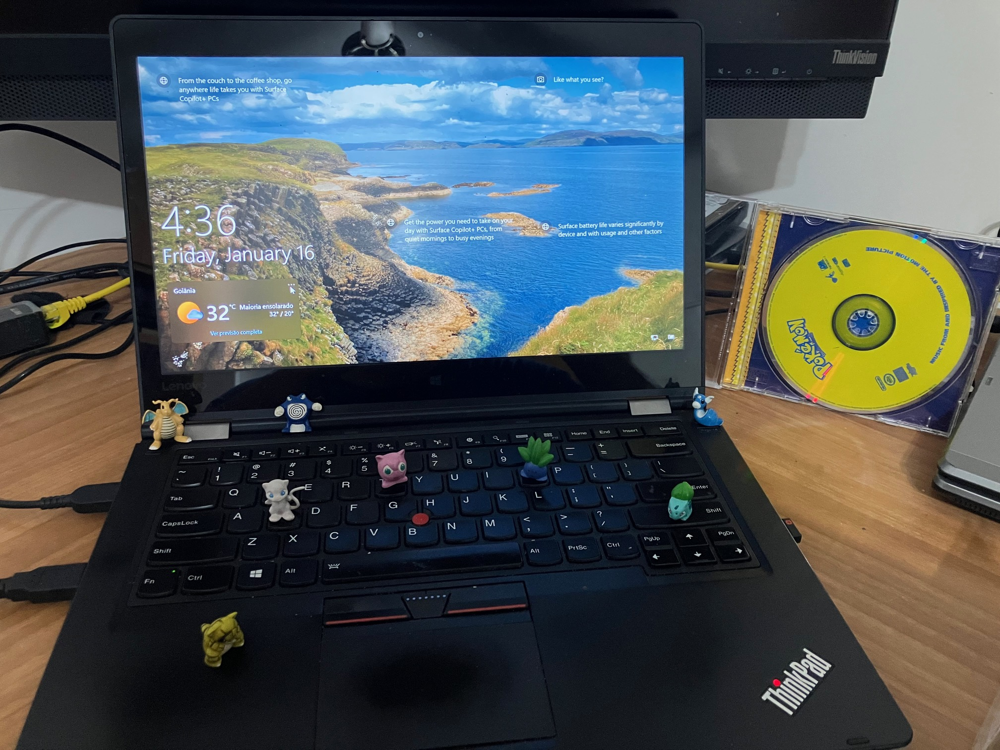

# ⚡ Case Study: Pokémon Center Localization (PT-BR)

## 🎯 Objective
To demonstrate a strategic localization and UX approach for the **Pokémon Center Landing Page**. This "Vertical Slice" study addresses the **"Experience Gap"** between brand engagement and retail conversion for Portuguese-speaking fans, focusing on the most critical entry point of the e-commerce journey.

---

## 💡 Business Case: The "Brazilian Gap"

* **Current Landscape:** While TPCi maintains a strong digital presence in Brazil via `pokemon.com/br`, the official retail arm (`pokemoncenter.com`) lacks PT-BR localization and regional support for South America.
* **Strategic Opportunity:** Thousands of high-purchasing-power Brazilian fans travel annually to the US, UK, and Germany (regions where the Pokémon Center operates). The **2026 World Cup** in the USA will significantly amplify this foot traffic.
* **The Solution:** A localized digital interface reduces friction for **"Global Travelers"**, allowing fans to navigate product specs, checkout flows, and brand-exclusive collections in their native language, maximizing retail revenue during global events.

---

## 🛠️ Technical Workflow & Methodology

### **CAT Tool Proficiency**
Full workflow executed in **MemoQ**, ensuring terminology consistency, rigorous QA, and tag protection for the underlying HTML structure.

### **UX Writing & UI Constraints**
Careful adaptation of navigation menus and buttons to prevent text truncation while maintaining a strong **"Call to Action" (CTA)** tone appropriate for high-conversion e-commerce.

### **Brand Integrity**
Strategic balance between translating functional terms (e.g., *"Figures"* to *"Colecionáveis"*) and preserving global sub-brands that carry significant brand equity (e.g., *"Sitting Cuties"*, *"SQUISHMALLOWS"*).

---

## 📁 Portfolio Structure

| Resource | Link | Description |
| :--- | :--- | :--- |
| **Source** | [Original HTML (EN-US)](https://pradoprojects.github.io/pokemon-center-enus/Pok%C3%A9mon%20Center%20Official%20Site.html) | Original landing page capture. |
| **Localized** | [Final HTML (PT-BR)](https://pradoprojects.github.io/pokemon-center-ptbr/Pok%C3%A9mon%20Center%20Official%20Site.html) | Localized interface with cultural and UX adaptations. |
| **Documentation** | [Context & Bilingual](https://github.com/pradoprojects/pokemon-center-ptbr/tree/main/Context%20and%20Bilingual) | Detailed editorial rationale, LQA decisions, and MemoQ bilingual files. |

> [!NOTE]
> This study focuses on the **Main Landing Page** as a primary touchpoint for user conversion. Due to the nature of static mirrors, some dynamic elements (such as submenus) may not trigger as they would on the native server infrastructure. However, **all localized strings and hidden elements** are fully documented within the **Bilingual file**. Links leading away from the Landing Page will redirect to the live (EN-US) production site.

---

## 🎬 Behind the Scenes

  

  <em>Creative workspace and brand references during the localization process.</em>

---
**Localization Specialist:** Marllos Paiva Prado
